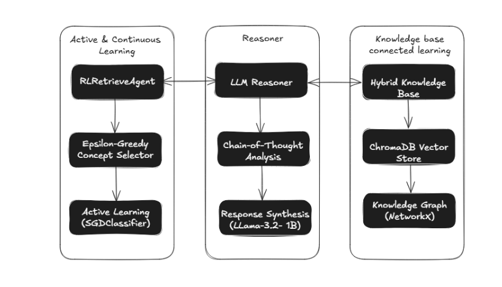

# PURR ( Probabilistic Unified Reasoning Reterveial )

AI system that combines reinforcement learning (RL), structured knowledge graphs, and neural retrieval techniques to dynamically select and reason over specific facts and concepts or training data. It enable even small LLMs to produce clearly structured, understandable detailed Chain-of-thought, active learning.

## System Architecture

## Motivation 

The PURR system leverages a pre-trained Llama-3.2B Instruct model, combined with a Reinforcement Learning (RL) Retrieval Agent and a Hybrid Knowledge Base, to specialize in biological reasoning—particularly about cats—without requiring fine-tuning. Its chain-of-thought (CoT) reasoning produces highly structured and logical outputs, showcasing the power of retrieval-augmented generation (RAG) and prompt engineering. The modular architecture allows for easy adaptation to training or fine-tuning, making it a potential component in Mixture of Experts (MoE) systems for state-of-the-art LLMs. By combining specialized experts with a routing mechanism, PURR could scale to diverse domains, offering efficient, domain-specific reasoning while maintaining generalization capabilities. This approach highlights the potential of integrating retrieval, reinforcement learning, and pre-trained LLMs for advanced AI systems.